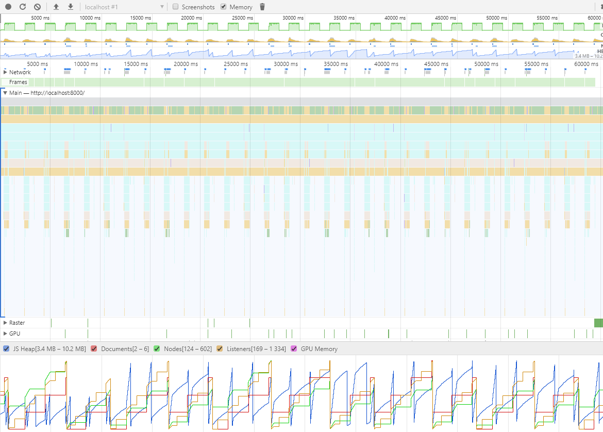
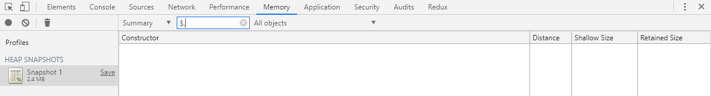

# Memory leaks

Navigator, buttongroups and buttons weren't destroyed.

## Images

### Memory profile

During 60 seconds 30 viewers were created and deleted constantly via setInterval/setTimeout.

### Heap snapshot

The heap snapshot doesn't contain any "Detached elements" or `$.` prefixed OpenSeadragon object instances after the 30 creations/deletions.

